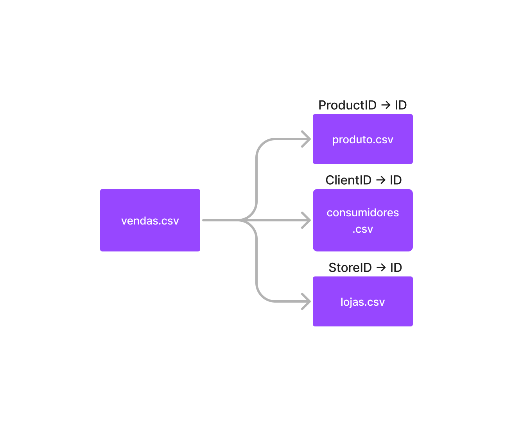

# Steps

- Using python 3.10.0
- create virtual environment
- create basic files (README.md, .gitignore, etc)
- install packages and create requirements.txt via `pip freeze > requirements.txt`
- import and clean data with `clean-data.ipynb`
- exploration aswering some questions with `eda.ipynb`

# Overview

## Dados de venda
- ID: identificador único de uma venda
- ProductID: identificador único de um produto
- ClientID: identificador único de um cliente
- Discount: desconto aplicado em uma venda
- UnitPrice: preço unitário de um produto vendido
- Quantity: quantidade de produto vendido em uma venda
- StoreID: identificador único de uma loja
- Date: data de uma venda

## Dados de consumidores
- ID: identificador único de um consumidor
- City: cidade/localidade onde um consumidor fez a compra
- State: Unidade Federativa onde um consumidor fez a compra
- DateOfBirth: data de nascimento de um consumidor
- Sexo: sexo de um consumidor

## Dados de lojas
- ID: identificador único de uma loja
- Name: cidade/localidade de uma loja
- State: Unidade Federativa de uma loja

##  Dados de produto
- ID: identificador único de um produto
- Name: nome de um produto
- Size: tamanho de um produto

## Data schema

